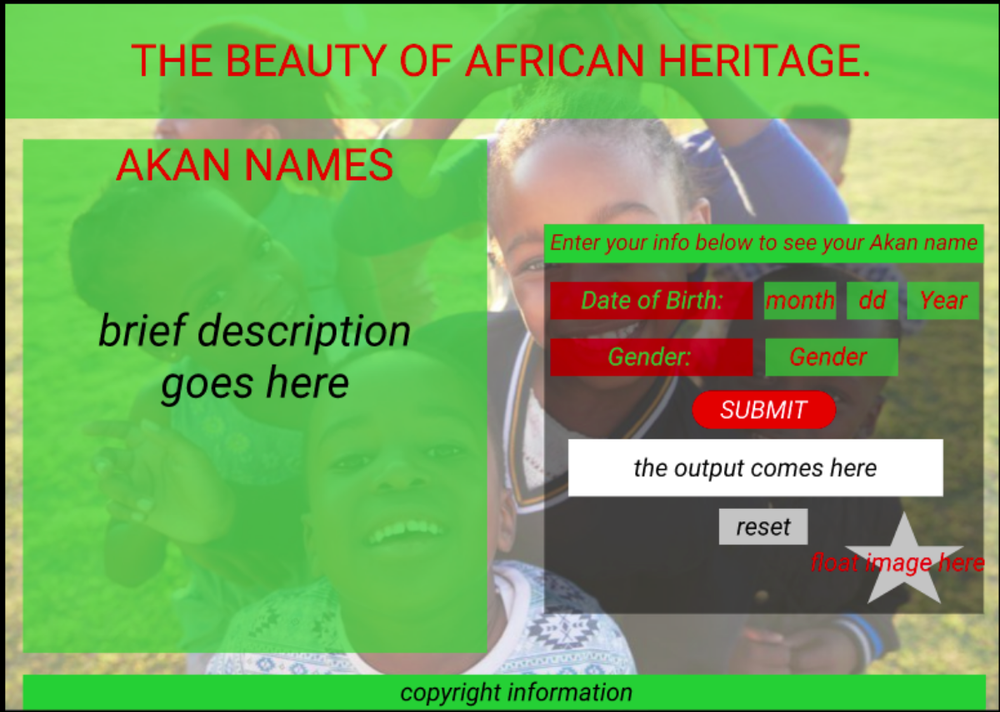

# Portfolio Landing Page
#### This is a website containing information about my Professional Portfolio
#### By **Nyambura Kelvin Njuguna**

## Description.
The Akan Name Generator is a website that accepts the user input (Date of birth and Gender), and used these inputs to generate the day of the week when the user was born alongside their Akan name.

## Prototype.

## Setup/Installation Requirements.
* Install Google Chrome on your machine.
* click the live link i.e. open the live link using google chrome to view the portfolio land webpage.
* Enter the date of birth and click submit to view your Akan name.

## Live link.
https://kevson102.github.io/Akan-Name-Generator/

## Known Bugs
* The name is generated for years between 1600 and 3099 only.
## Technologies Used
1. HTML
2. CSS
3. JavaScript
## Support and contact details
* Email: Kevson3941@gmail.com
* Phone no. +254 733 916258
### License
<a href="./LICENSE.MD" target = "_blank">MIT</a>

Copyright (c) 2021 **Portfolio Landing page-Nyambura Kelvin Njuguna**